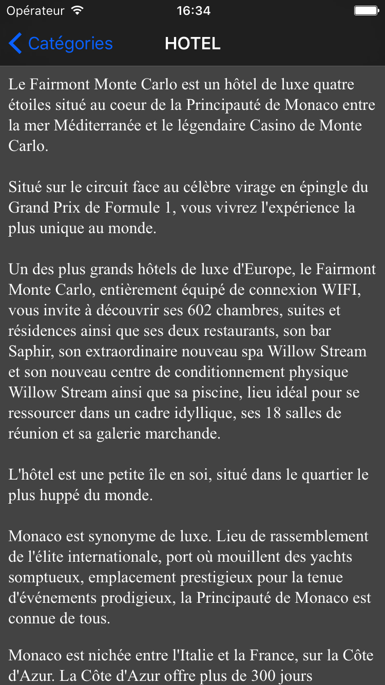

# tp_event_ios
Application qui permet d'afficher des événements en fonction de différentes sections + formulaire de contact

## Page d'accueil

## Détail d'un événement avec texte

## Détail d'un événement avec image

## Page de contact

## Page de contact avec formulaire invalide

## Page de contact avec formulaire valide

